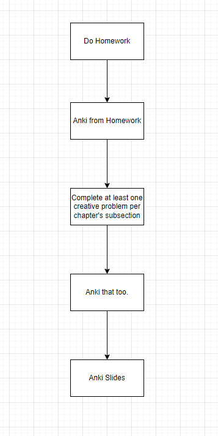
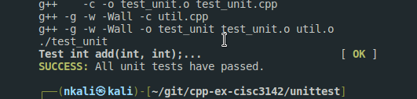

# cpp-ex-cisc3142
Solved Exercises from the book

## Study Plan (Nelson)

Here's a [Gantt Chart](https://app.diagrams.net/#G1FtsFi1zWgK0b5wG2Z7V8TEbjJ7Rzvfsj) indiciates the plan for studying.




## Unit Testing

I was playing with Unit testing from this tutorial

[Makefiles and Unit Testing](https://youtu.be/H6x53F5Do24)

Requirements:
- [acutest](https://github.com/mity/acutest/blob/master/include/acutest.h)

```
curl https://raw.githubusercontent.com/mity/acutest/master/include/acutest.h > acutest.hpp
```




## Ubuntu Requirements

- gnu compileraa.