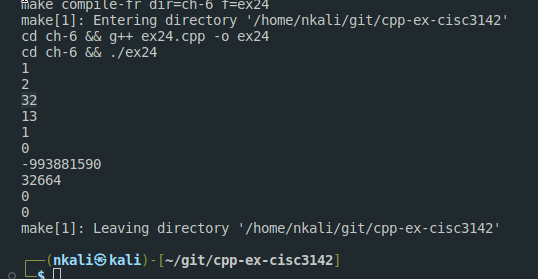

# Notes from Nelson 


I will be taking the %3 == 0 Exercises

The search pattern will be like this:

Exercises Progress
[Google Sheet Link](https://docs.google.com/spreadsheets/d/1Ou_V5HzMNuFlPko-Ez3fu4mXvaeNGNl7EntsGRMVD68/edit?usp=sharing)

```
Exercise 6.3
```


## Written Problem's Solutions


### 6.6

Exercise 6.6: Explain the differences between a parameter, a local variable, and a local
static variable. Give an example of a function in which each might be useful.

```
Parameters are arguments sent.
Then static variables are static that they dont dissapear

```

### 6.9

Exercise 6.9: Write your own versions of the fact.cc and factMain.cc files. These
files should include your Chapter6.h from the exercises in the previous section. Use
these files to understand how your compiler supports separate compilation.

### 6.15

I didn't understand this one.


### 6.18


A function named compare that returns a bool and has two parameters that
are references to a class named matrix.

```
isSameMatrix()
```

(b) A function named change_val that returns a vector<int> iterator and
takes two parameters: One is an int and the other is an iterator for a vector<int>.

```
getVector
```

### 6.21

Exercise 6.21: Write a function that takes an int and a pointer to an int and returns
the larger of the int value or the value to which the pointer points. What type should
you use for the pointer?

```cpp title="ex21.cpp"

int getLarger(int val, int *pointer){
    return  max(val, *pointer);
}

```


To test this I added the test in `test_unit.cpp`

```cpp
#include "acutest.hpp"
#include "ex21.cpp"

void test21(void){

    int val1= 21;
    int val2= 40;
    int *val2p = &val2;
    TEST_CHECK_(getLarger(val1, val2p) == (*val2p), "add");

    val1+=30;
    TEST_CHECK_(getLarger(val1, val2p) == (val1), "add");
}


TEST_LIST = {
    {"Test Ex.21", test21},
    {0}
};
```

### 6.24

Exercise 6.24: Explain the behavior of the following function. If there are problems in
the code, explain what they are and how you might fix them



```
The problem that seems to be here, is that if the array is larger than the requested size.
It will print some unrelated values. 
```


